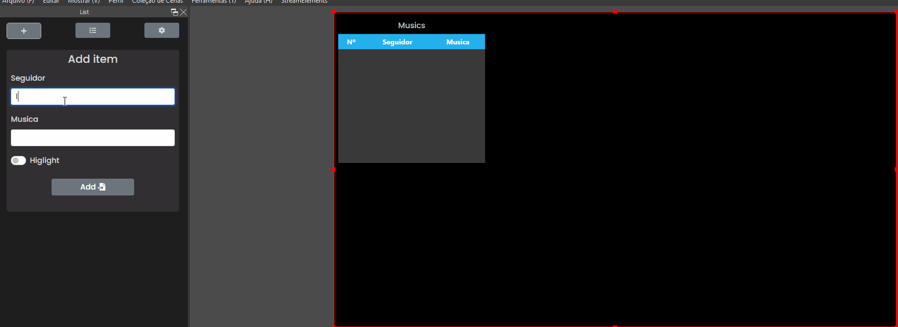
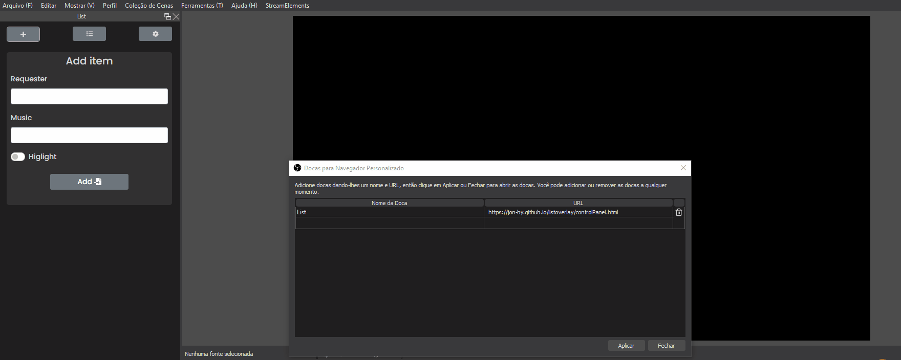
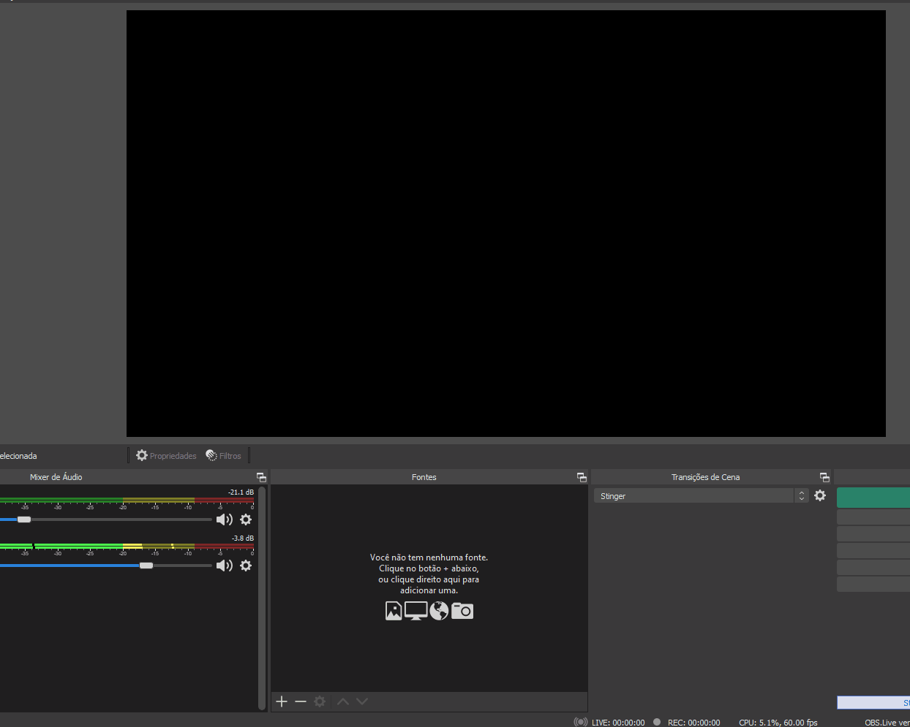

<h2>OBS List Overlay</h1>

 Um overlay de lista para OBS studio :memo:

 

    

<h4 style="text-align:center;">Instalação:</h4>

<h5>Painel de controle</h5>

Abra seu OBS studio e clique em: <strong>Mostrar > Docas > Docas para navegação personalizado</strong>

Na janela que se abre, em nome da doca, coloque o nome de sua preferência.

Em URL, coloque a seguinte URL: 

    https://jon-by.github.io/listoverlay/controlPanel.html

<h5>Overlay</h5>

    Apenas configure uma nova fonte de navegador apontando para a seguinte URL:

    https://jon-by.github.io/listoverlay

⚙️ A largura e altura da tela devem possuir o mesmo tamanho definido no painel de controle da lita.    

    Sempre que possível eu vou atualizar a lista com novas funcionalidades. Para garntir que você esteja usando sempre os útimos recursos, utilize sempre as URL's disponibilizadas aqui.

Fique a vontade para sugerir funcionalidades e mudanças. Para isso, basta abrir uma issue no topo dessa página.

Você me encontra gerênciando a live da<a href="https://www.twitch.tv/beatrizxavierjd"> BeatrizXavierjd</a>

